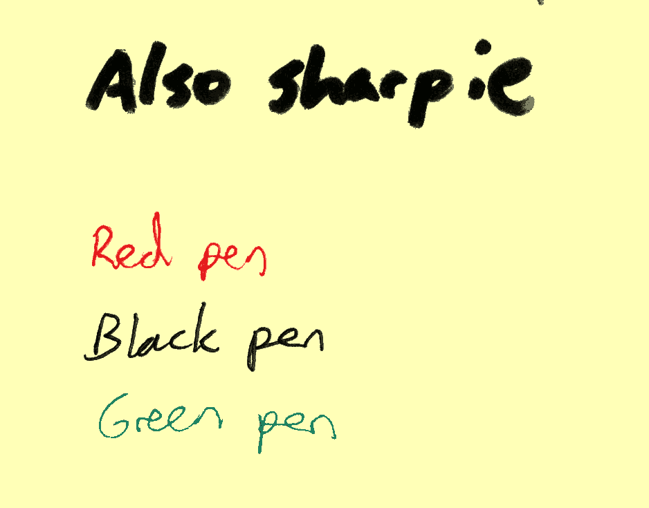

# NoteShrink demo

### Examples

  
**83036** bytes

See all imageset [examples](examples).

### [NoteShrink.py](https://github.com/mzucker/noteshrink) (defaul options, post-processing: [Bash-OptImg](https://github.com/BASH-Auto-Tools/bash-optimg))

  
**11205** bytes

See all imageset [output-origin-py](output-origin-py).

### [NoteShrink-c](https://github.com/ImageProcessing-ElectronicPublications/noteshrink-c) (defaul options, post-processing: [Bash-OptImg](https://github.com/BASH-Auto-Tools/bash-optimg))

  
**8743** bytes

See all imageset [output-c](output-c).
