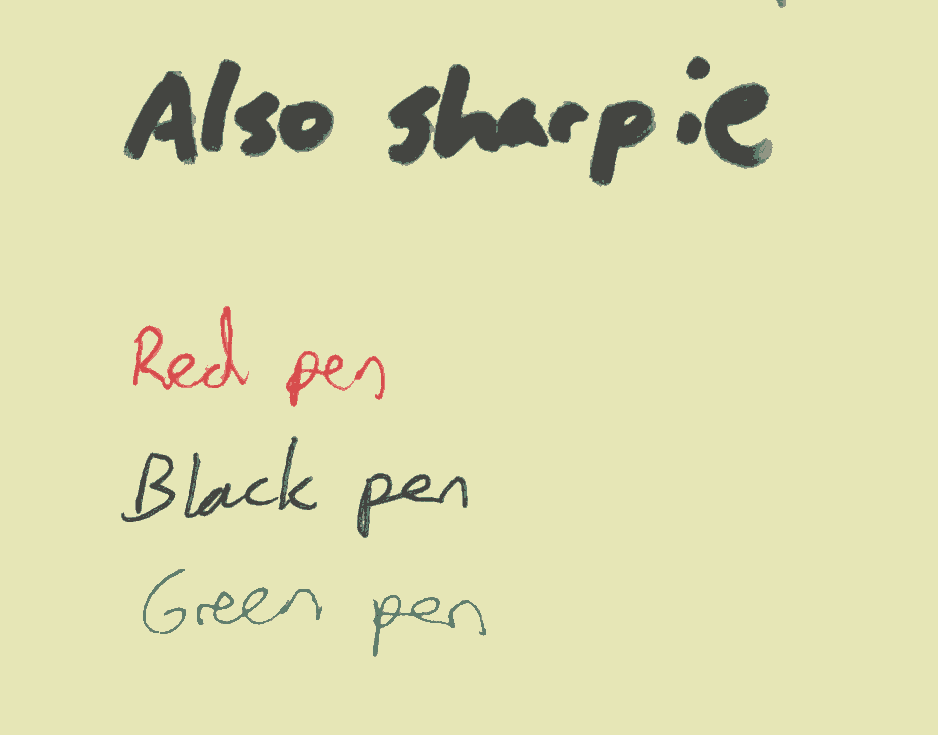

# NoteShrink demo

## [NoteShrink-c](https://github.com/ImageProcessing-ElectronicPublications/noteshrink-c) (defaul options, post-processing: [Bash-OptImg](https://github.com/BASH-Auto-Tools/bash-optimg))

  
**40335** bytes

  
**8743** bytes

  
**11751** bytes

  
**99532** bytes

  
**79652** bytes

  
**81844** bytes

  
**52691** bytes

  
**67648** bytes
