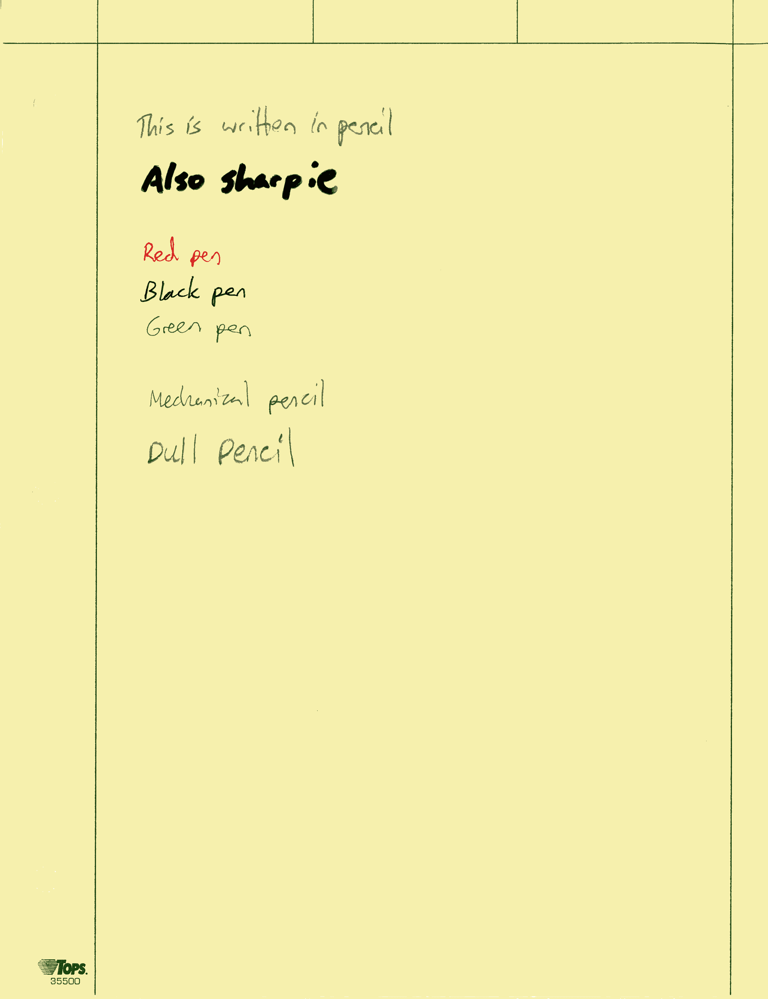
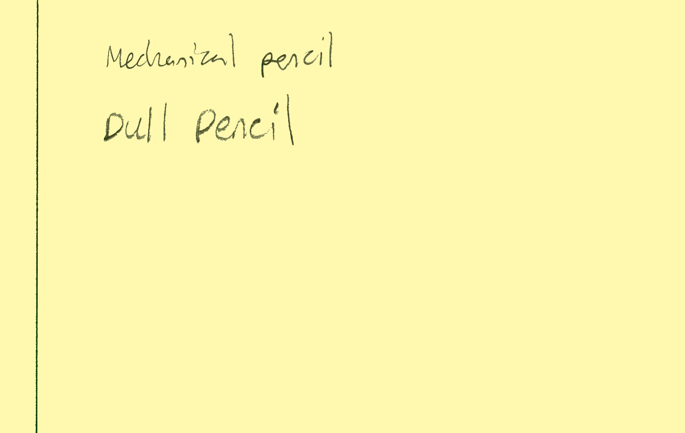
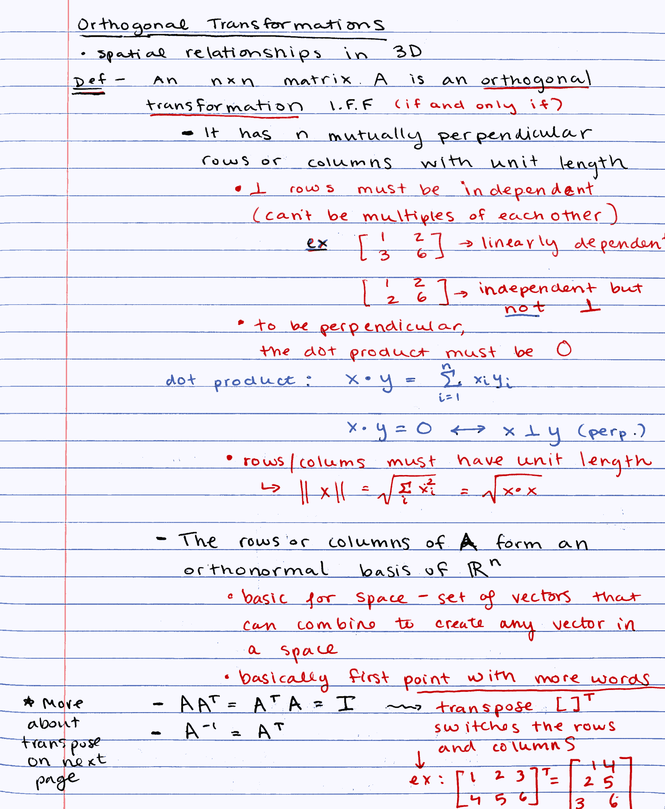
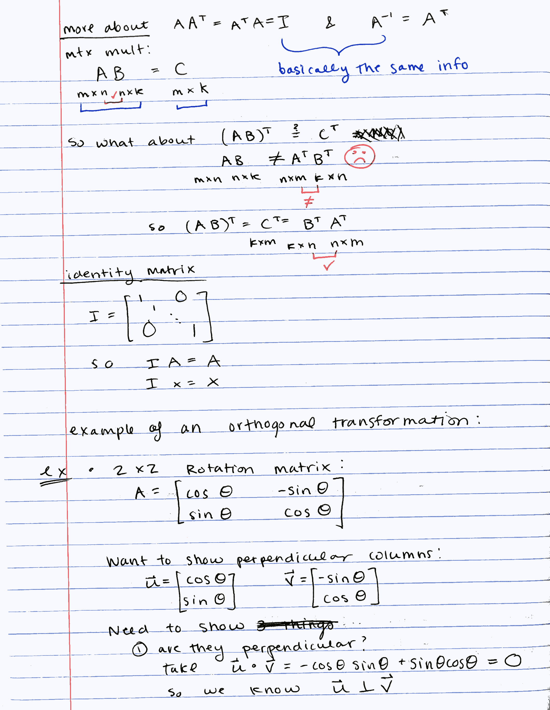
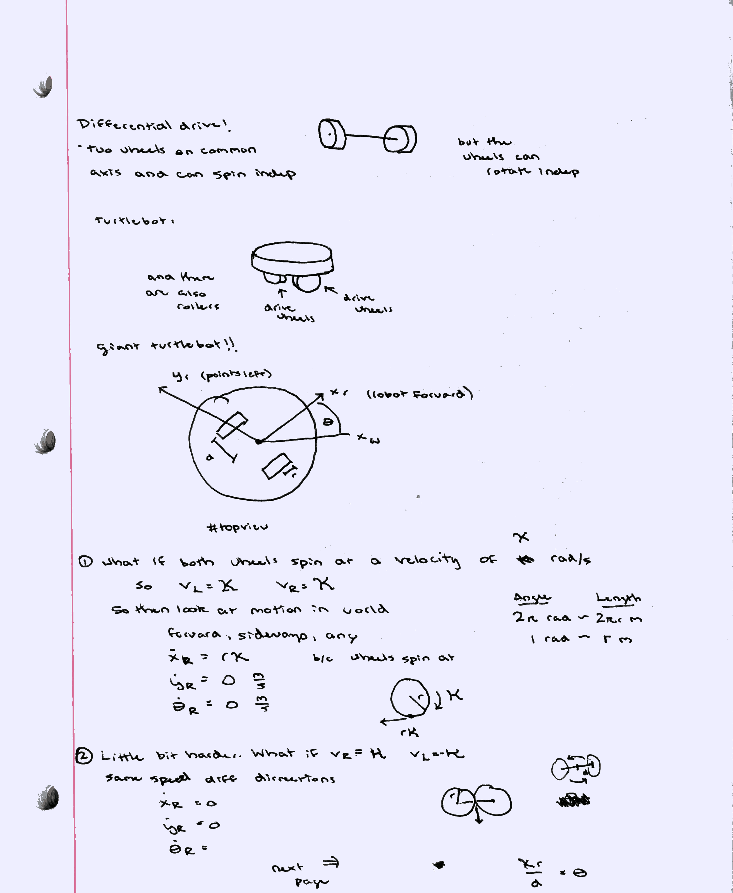
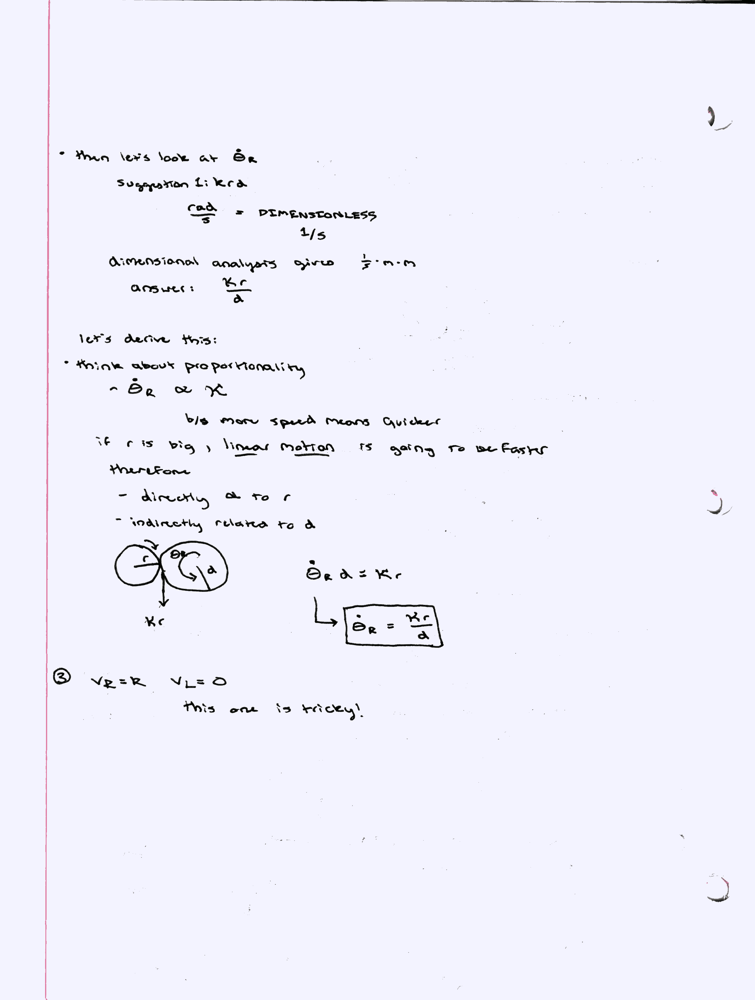
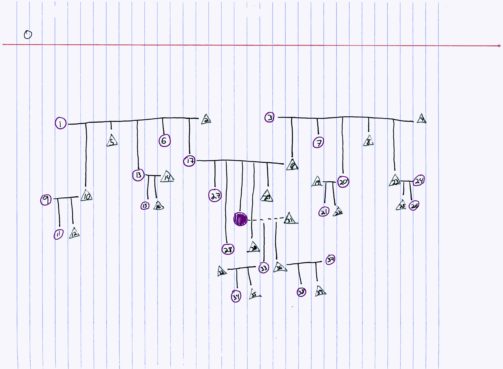

# NoteShrink demo

## [NoteShrink.py](https://github.com/mzucker/noteshrink) (defaul options, post-processing: [Bash-OptImg](https://github.com/BASH-Auto-Tools/bash-optimg))

  
**48625** bytes

  
**11205** bytes

  
**12726** bytes

  
**113235** bytes

  
**99198** bytes

  
**122159** bytes

  
**73012** bytes

  
**123183** bytes
